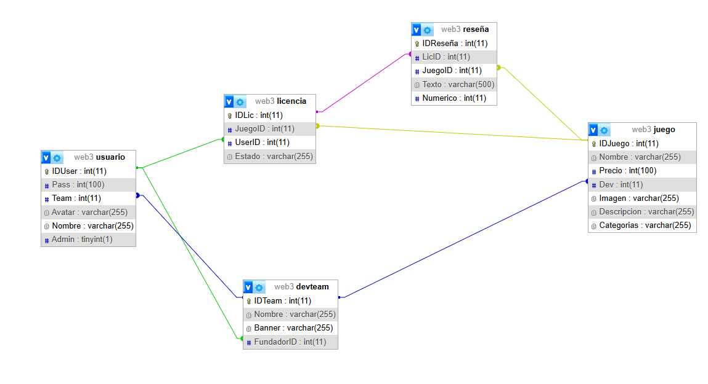
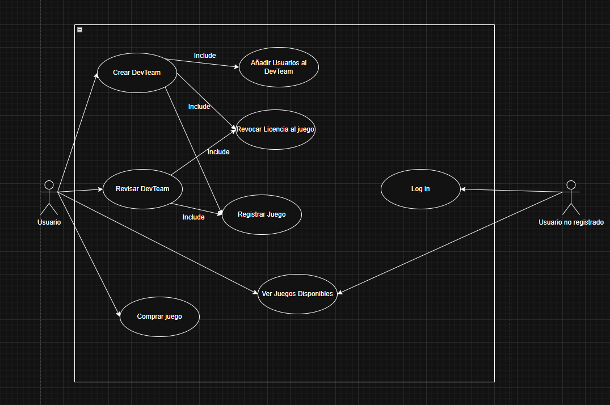

# Proyecto: Floppy Disk™

# Alumno: Valentino Coppola 

# Tabla de contenidos 📜
## Introduccion:
el sistema Floppy Disk™ sera desarrollado en C# diseñado para la compra, venta y revocacion de licencias digitales para el acceso y reseña de juegos digitales

## Justificacion
el proyecto satisfacera la necesidad de competencia en una de las industrias mas grandes del mundo, generando una gran cantidad de ganancias y ganandose un nombre en la industria

## Objetivo general del proyecto
este proyecto trata de generar un ambiente mas favorable para desarrolladores de juegos digitales, este escenario totalmente monopolizado por 'Steam', cuya compañia 'Valve' se lleva una cantidad muy alta del dinero generado por su 	plataforma

## Limite ✔
permite la compra, venta y revocacion de licencias 
dichas licencias permiten al usuario acceder y reseñar el juego por el que hayan pagado 
el usuario puede publicar juegos con su equipo de desarrollo
el fundador del equipo podra añadir a otros usuarios al equipo
usuarios que sean parte del equipo podran revocar licencias de sus juegos

## no contemplado ❌
el pago de las licencias

## Tecnologias
C#
ASP.Net Core MVC
vue.js

## Competencia
'Steam' de 'Valve'
 
'Epic Games Store' de 'Epic Games'
 
'Good Old Games' de 'CD Projekt'

# Analisis y Diseño 📋
## Diagrama de clases

 

## Diagrama de casos de uso mas relevantes
 

